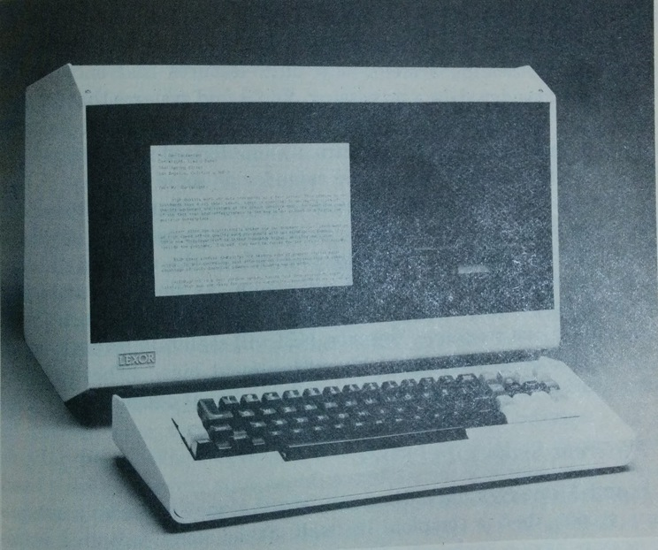

\pagebreak 

# Section 1

## Subsection 1.1

Lorem _ipsum_ dolor sit amet, **consectetur** adipisicing elit, sed do eiusmod tempor incididunt ut labore et dolore magna aliqua. Ut enim ad minim veniam, quis nostrud exercitation ullamco laboris nisi ut aliquip ex ea commodo consequat.

## Subsection 1.2

Sed ut perspiciatis unde omnis iste natus error sit voluptatem accusantium doloremque laudantium, totam rem aperiam, eaque  ipsa quae ab illo inventore veritatis et quasi architecto beatae vitae dicta sunt explicabo.

Next paragraph should start like this. Do not indent.

# Section 2

## Subsection 2.1

## Subsection 2.2

A sentence that needs a note.[^1]

This is a second sentence that requires an inline citation where the author's names, in this case @fyfe_digital_2011, are a part of the sentence.

The second citation style has all the reference information appear inside the brackets [@fyfe_digital_2011].

[^1]: my first footnote! And a [link](https://www.eff.org/). 

\pagebreak 

## Bibliography \newline